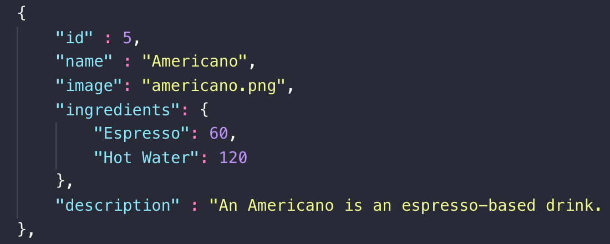

# Barisso
https://barisso-app.herokuapp.com

## Summary
Barisso is a Full Stack React application for coffee lovers. Barisso is designed as a simple-to-use application to learn more about how different coffee drinks are made and even to search for coffee shops near you using geolocation to get your java fix. Mobile-responsiveness was kept in mind, as the user should be able to look for coffee on the go or look at their phone while in the kitchen preparing a drink.

### View Coffee Recipes
* Barisso has a built-in selection of many espresso-based beverage recipes. 
* Upon visiting the "Drinks" page, the user can view the selection and view a recipe.
* A mug building engine has been built from scratch to dynamically animate any recipe into a smooth and fun-to-watch animation. More detail in the following section.
  

### Drink Building Engine
* A drink building engine has been designed from scratch to show a smooth animation for whatever ingredients and amounts are passed in.
* An example of the engine is shown in the GIF below.

* The recipe for each drink is formatted into a JSON file. This file contains data about measurements for each ingredient. The drink building engine will then calculate based on the total volume of the drink how much space on the screen should be dedicated to each ingredient.

* Each ingredient within the mug is represented by an individual React component. The proper component is determined by the engine and passed into the JSX.
* A dynamic animation delay setting is passed onto each ingredient so that each ingredient fills up one after the other. 
* With this system, any recipe comprised of existing ingredient components can be built dynamically.

### Search for Nearby Coffee
* The application utilizes the Google Places API along with the user's geolocation from the browser (with permission, of course) to search for coffee shops near them. 
* If the user is logged in, they can also add shops to their favorites list and view them later in their profile to keep tabs on on the best local spots. 
* Additionally, if a user no longer wants to see a particular coffee shop in search results, they can press the trash can icon to remove that location from future searches. These can also be managed in the profile area.
* Note that, while favoriting and banning features will not be availble while not logged in, the search feature is still accessible to anyone.

